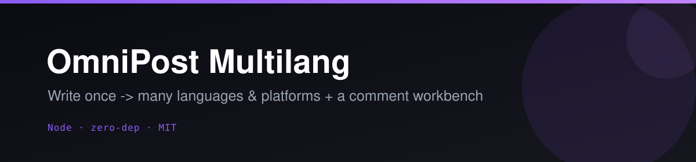
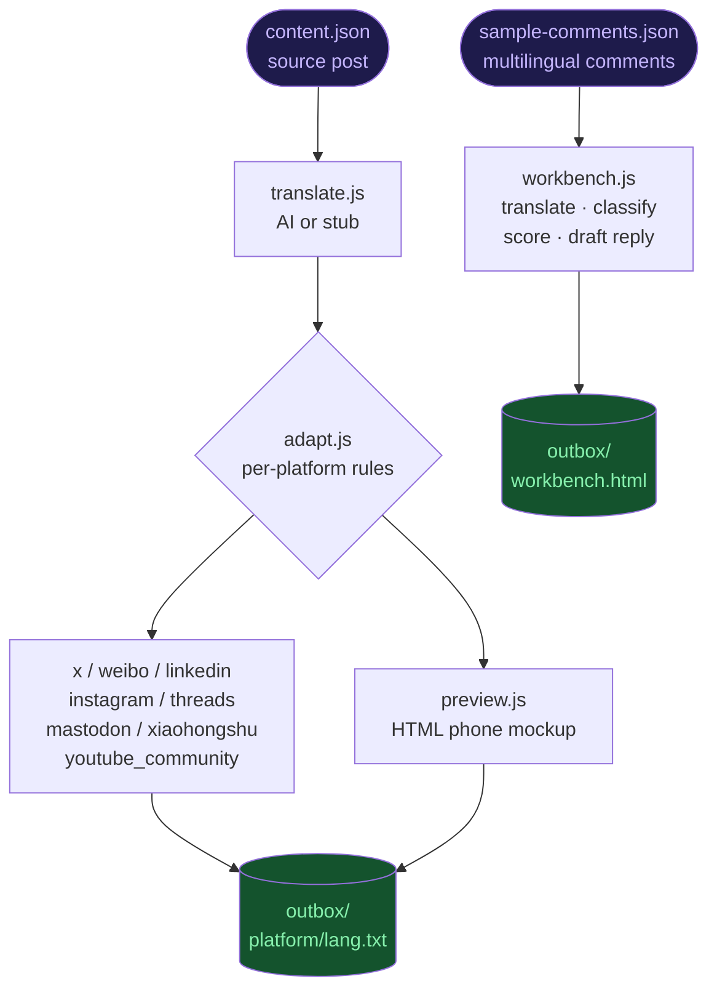

<p align="center"></p>

<p align="center">
  <a href="LICENSE"></a>
  
  
  
  
</p>

# 🌐 OmniPost Multilang

**Write once, publish everywhere — in every language your audience speaks.**

OmniPost Multilang translates a single source post into multiple languages, adapts each variant to the character limits, hashtag conventions, and quirks of 8+ platforms, and generates a beautiful HTML preview so you can review everything before a single token hits a real API. A built-in comment workbench then pulls in multilingual replies, classifies intent, scores priority, and drafts responses — all from one CLI.

No API keys required to get started. Everything runs in dry-run / stub mode out of the box.

---

## ✨ Features

- **Multi-language translation** — AI-powered via Anthropic claude-sonnet (or zero-key stub mode that tags `[lang]` without any API call)
- **8 platform adapters** — X/Twitter (with auto thread-splitting), Weibo, LinkedIn, Instagram, Threads, Mastodon, Xiaohongshu, and YouTube Community; all config-driven in `adapt.js`
- **Smart truncation** — sentence-boundary-aware cuts, per-platform hashtag/mention styling, emoji budgets, and char-count meters
- **HTML preview** — dark-theme phone-mockup page showing every language × platform variant with over-limit warnings; review before you publish
- **Dry-run by default** — the `file` connector writes real output to `outbox/`; all platform connectors are stubs that never throw until you supply a token
- **Comment workbench** — load multilingual comments, translate to your language, classify intent (lead / question / complaint / praise / spam), score priority, draft replies, and browse in a full inbox-style HTML triage UI
- **Zero npm dependencies** — uses only Node.js built-ins (`fs`, `path`, global `fetch`); requires Node 18+
- **Immutable data flow** — no object mutation; all transforms return new objects

---

## 🎬 How it works



---

## 🚀 Quickstart

```bash
# Clone and enter the project
git clone https://github.com/Alchemist-X/omnipost-multilang.git
cd omnipost-multilang

# No install step needed — zero dependencies

# Dry-run: translate into 3 languages, write to outbox/ + preview.html
node index.js publish --content content.json --langs en,zh,ja

# With specific platforms
node index.js publish --content content.json --langs en,zh,ja,es --platforms x,weibo,linkedin,instagram,threads

# Preview-only (no outbox write)
node index.js preview --content content.json --langs en,zh,ja --platforms x,weibo,linkedin

# Live mode: call real connectors (requires tokens in .env)
node index.js publish --content content.json --langs en,zh --platforms x,linkedin --live

# Comment workbench (CLI summary + workbench.html)
node index.js workbench

# Workbench with comments translated to Chinese
node index.js workbench --lang zh
```

Open `outbox/preview.html` in your browser after any `publish` or `preview` run to see the phone-mockup for every variant.

---

## ⚙️ Configuration

Copy `.env.example` to `.env`. **Everything is optional** — the tool runs fully in stub/dry-run mode without any keys.

### Translation

| Variable | Purpose |
|---|---|
| `ANTHROPIC_API_KEY` | Real AI translation via claude-sonnet. Without it: stub mode (posts tagged `[lang]`). |
| `LLM_API_KEY` | Alternative: any OpenAI-compatible key (Kimi/Moonshot, OpenAI, etc.) |
| `LLM_BASE_URL` | Base URL for the OpenAI-compatible endpoint (e.g. `https://api.moonshot.cn/v1`) |
| `LLM_MODEL` | Model name for the OpenAI-compatible provider (e.g. `moonshot-v1-8k`) |

> **Heuristic fallback:** if `ANTHROPIC_API_KEY` is absent but `LLM_API_KEY` + `LLM_BASE_URL` are set, the translate module falls back to the OpenAI-compatible endpoint automatically.

### Platform Connectors

| Variable | Platform |
|---|---|
| `X_BEARER_TOKEN` | X (Twitter) |
| `WEIBO_ACCESS_TOKEN` | Weibo |
| `LINKEDIN_ACCESS_TOKEN` + `LINKEDIN_PERSON_URN` | LinkedIn |
| `INSTAGRAM_ACCESS_TOKEN` + `INSTAGRAM_USER_ID` | Instagram |
| `THREADS_ACCESS_TOKEN` + `THREADS_USER_ID` | Threads |
| `MASTODON_ACCESS_TOKEN` | Mastodon (+ optional `MASTODON_INSTANCE_URL`) |
| `XHS_ACCESS_TOKEN` + `XHS_USER_ID` | Xiaohongshu / 小红书 |
| `YOUTUBE_OAUTH_TOKEN` + `YOUTUBE_CHANNEL_ID` | YouTube Community |

See `.env.example` for all variables and links to each platform's developer dashboard.

### Platforms at a Glance

| Platform | Key | Char Limit | Special |
|---|---|---|---|
| X (Twitter) | `x` | 280 | Auto-thread for long content |
| Weibo | `weibo` | 2000 | `#wrapped#` hashtags |
| LinkedIn | `linkedin` | 3000 | Title as headline |
| Instagram | `instagram` | 2200 | Hashtag block at end, max 30 |
| Threads | `threads` | 500 | — |
| Mastodon | `mastodon` | 500 | Open protocol |
| Xiaohongshu | `xiaohongshu` | 1000 | `[topic]` style, title prominent |
| YouTube Community | `youtube_community` | 5000 | — |
| File (dry-run) | `file` | ∞ | Always real, no tokens needed |

---

## 🗺️ Roadmap / Needs

Platform connectors are currently stubs — contributions welcome:

- [ ] OAuth 1.0a signing for X (Twitter) posting
- [ ] Weibo, LinkedIn, Threads full posting implementation
- [ ] Image/video attachment support (Instagram, Xiaohongshu)
- [ ] Scheduling / queue support (post at a future time)
- [ ] Web UI wrapper around the CLI preview + workbench
- [ ] OpenAI-compatible translate adapter (Kimi, OpenAI, etc.)

Pull requests and issue reports are very welcome. See `adapt.js` for how easy it is to add or tweak a platform.

---

## 📄 License

MIT © 2026 Alchemist-X

---

<p align="center">If OmniPost saves you time, consider giving it a ⭐ — it helps others find the project.</p>
